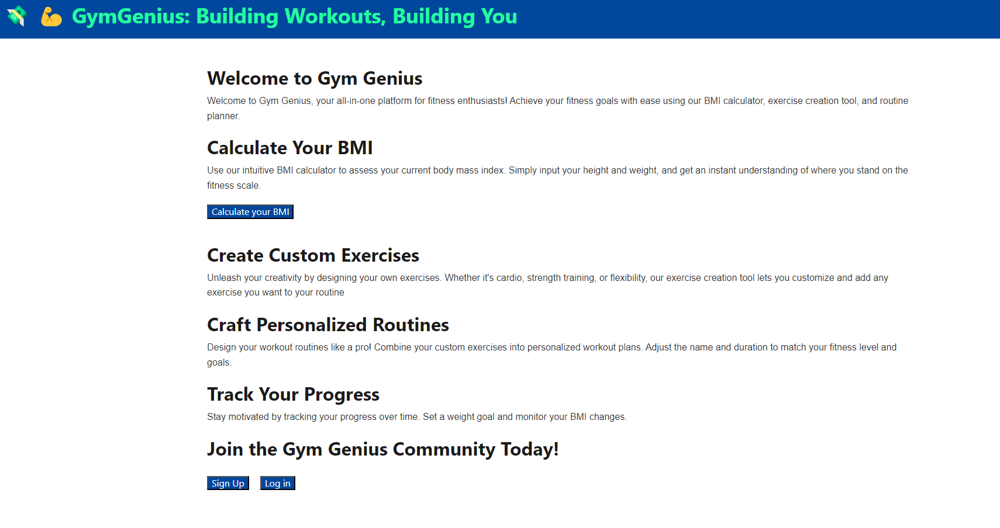
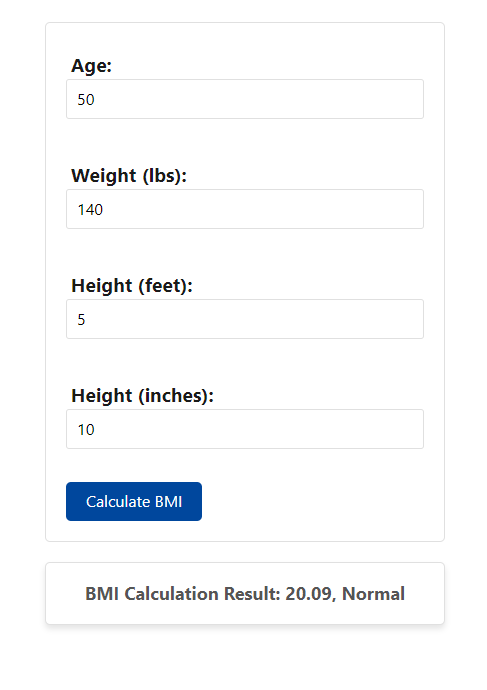
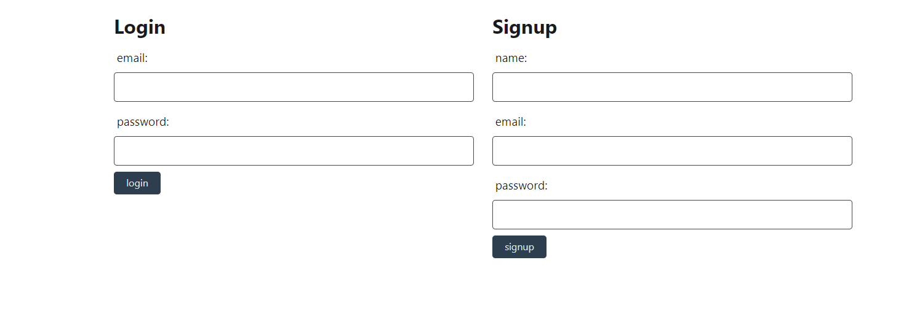
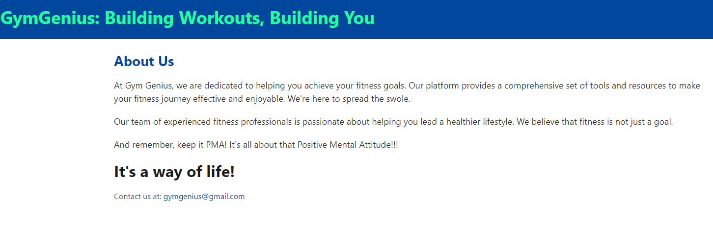

# Group 2 Project

https://github.com/wyattdronen/group-project-2

## Group Members
Cody Anderson  
Ben Poole  
Wyatt Dronen  
George Haworth  

## Description

This is an interactive fitness application.  Users are able to sign up and login to their profile and navigate the website.  They can logout when they are finished.

## Installation

N/A

## Usage

After users login they are able to calculate their BMI based on weight and height.  They are able to customize their workout plans to focus on their needs. They can choose from a variety of workouts from cardio to lifting weights and building muscle.

## Heroku App

https://fitness-tracker-1-c68af4d087c3.herokuapp.com/

## Contributors 
* Cody Anderson - https://github.com/cody-and
* Ben Poole - https://github.com/bpoole53
* George Haworth - https://github.com/ghaworth1
* Wyatt Dronen - https://github.com/wyattdronen

## Credits

N/A

## License

N/A
