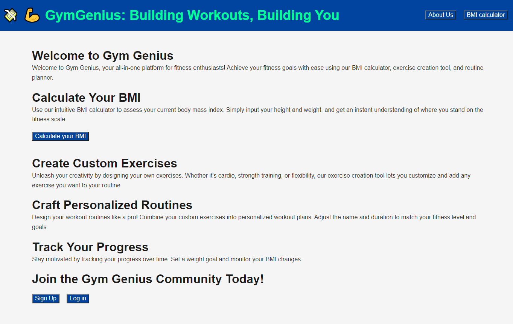
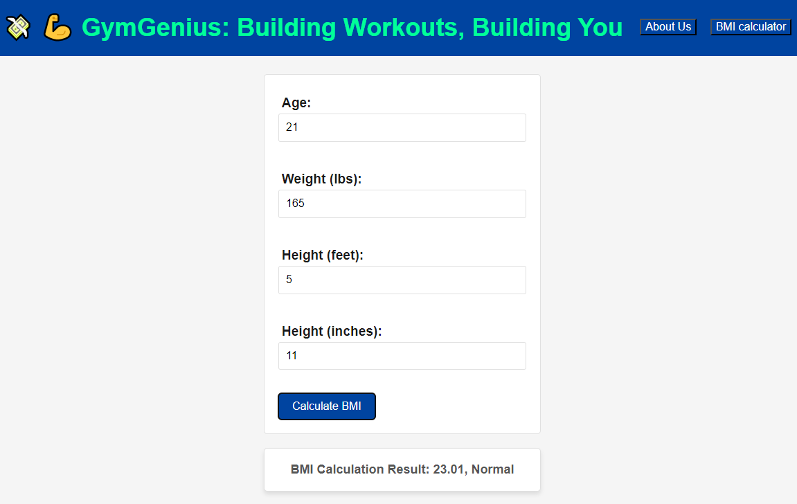
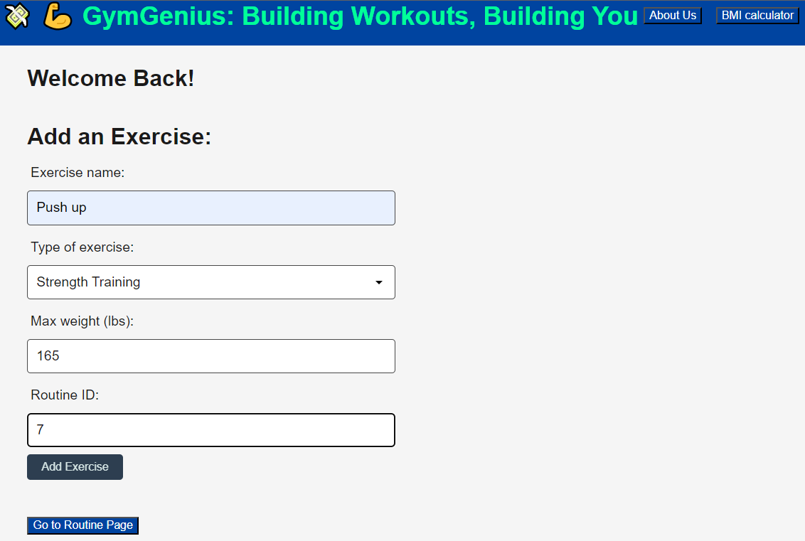

# Gym Genius

GymGenius is a comprehensive fitness and workout management web application designed to empower individuals on their journey to an improved physical well-being. This application offers a range of tools, resources, and features aimed at enhancing users' fitness experiences.

## Tech Stack

#### Programming Languages
- Handlebars: Used to dynamically create the frontend pages.

- CSS: Used to style the handlebars pages so they are pleasant to look at and have some continuity. 

- JavaScript: Used to write all of the backend code.

#### Node Packages Used

- Bcrypt: Used to encrypt users passwords.

- Dotenv: Used to manage environment variables.

- Express: Used to properly route the user to the correct page. 

- Express-handlebars: Used to display handlebars to the user.  

- Express-session: Used to create sessions for the user they do not get logged out every time they switch pages. 

- Mysql2: Used to manage the database.

- Sequelize: Used to make queries with the database easier to manage.  

#### Third Party API Used

- Fitness Calculator Api: Used to create a BMI calculator so the user can easily calculate their BMI. 

## FAQ

#### Question 1: How can I get started with Gym Genius?

**Answer**: To get started, simply sign up for a free account on our website. Once registered, you can explore workout plans, customize your routines, and start tracking your progress.

#### Question 2: How do I calculate my BMI with Gym Genius?

**Answer**: To calculate your BMI simply click on the BMI Calculator button at the top of the page. Once you are on the BMI Calculator page you can simply input your information in each field and click the calculate bmi button. You will then get your results right below the form. 

#### Question 3: Can I sync my wearable device data with Gym Genius?

**Answer**: Unfortunately we do not support wearable devices. This is something we will be working on in the future. 

## Deployment

To deploy this project follow this link: 

## Screenshots

## Run Locally

1. Clone the project repository.
2. Install the required dependencies using `npm install`.
3. Configure the database connection in the .env file.
4. Run `node seeds/index.js` to seed the database. 
5. Run the server using `node server.js`. 

## Authors

- [@cody-and](https://github.com/cody-and)
- [@wyattdronen](https://github.com/wyattdronen)
- [@bpoole53](https://github.com/bpoole53)

